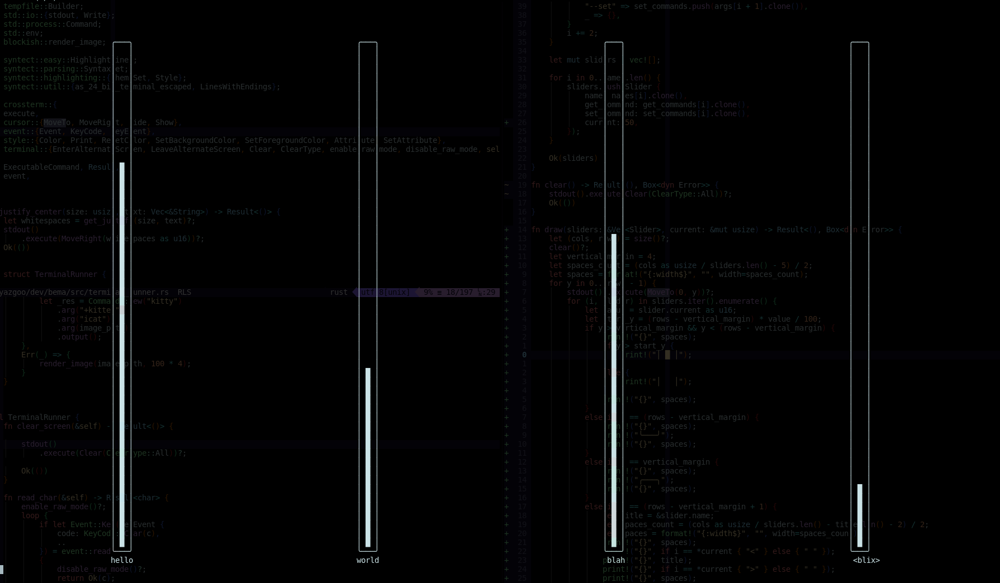
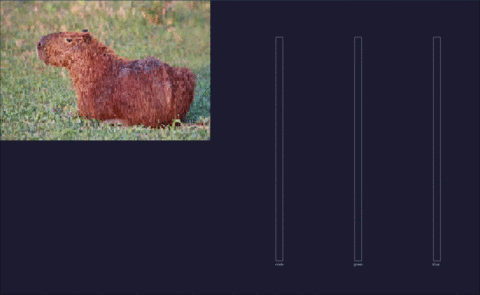

# sliders

sliders in the terminal.
can be used as a binary or as a crate.

# screenshots




screenshot from [examples/rgb.rs](examples/rgb.rs).

# using as a binary

## files counters

For this example, let's store counter in 2 files

```bash
$ echo 0 > hello.counter
$ echo 0 > world.counter
```

Then, let's launch two sliders which will write/read to/from those files:

```bash
cargo run -- --name hello --get 'cat hello.counter' --set 'echo {} > hello.counter' \
             --name world --get 'cat world.counter' --set 'echo {} > world.counter'
``` 

## backlight-mixer

You can use this to update your backlight with [backlight-mixer](https://github.com/yazgoo/backlight-mixer).

```bash
$ cargo run -- --name backlight --get "backlight-mixer" --set "backlight-mixer {}"
```

## volume mixer

```bash
$ cargo run -- --name volume \
               --get "amixer sget Master | tail -1 | cut -d'[' -f2 | cut -d'%' -f1" \
               --set "amixer sset Master {}%"
```
